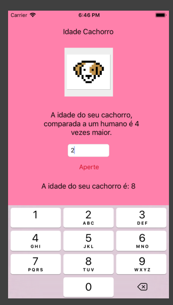

# Idade Cachorro Xcode10

Projeto para testar funcionalidade do Xcode

Neste app é possível verificar ação do botão com alteração da label.
Existe um seletor para o caso da caixa de texto estar vazia.
